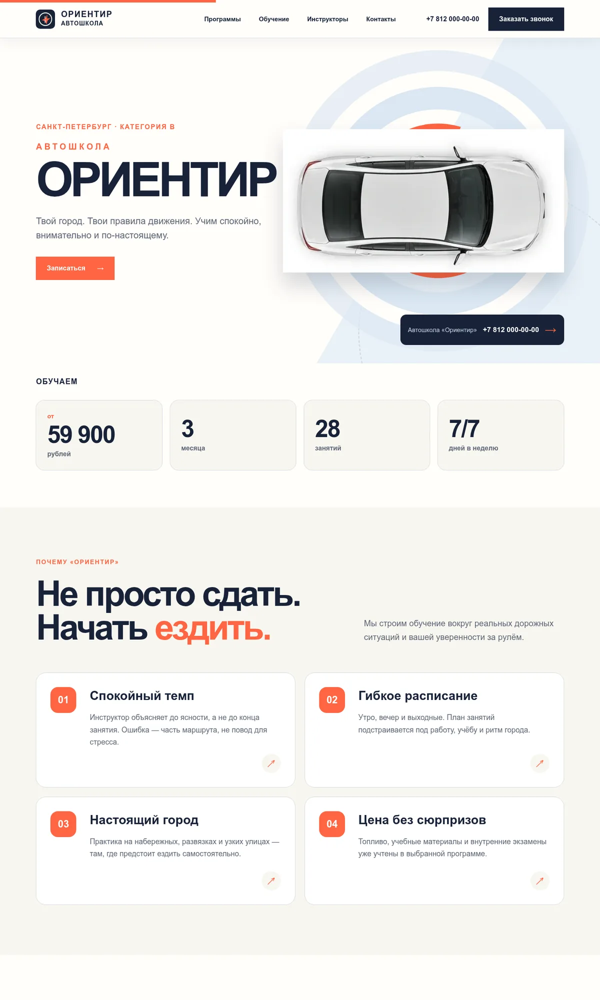
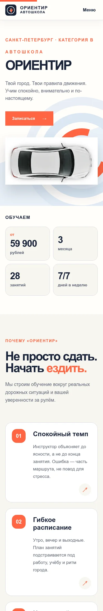

<p align="center">
  
</p>

<h1 align="center">Автошкола «Ориентир»</h1>

<p align="center">Адаптивный интерфейс сайта автошколы с программами обучения, командой инструкторов, Яндекс Картами и безопасной тестовой формой заявки.</p>

<p align="center">
  
  
  
  
</p>

## Превью

<p align="center">
  
</p>

<details>
  <summary><b>Мобильная версия</b></summary>
  <br>
  <p align="center"></p>
</details>

## Возможности

- адаптивная вёрстка для компьютеров, планшетов и телефонов;
- оптимизированные изображения транспорта с ленивой загрузкой;
- компактные и понятные карточки инструкторов;
- анимации GSAP и плавная прокрутка Lenis;
- поддержка `prefers-reduced-motion`;
- доступные мобильное меню, FAQ и модальное окно;
- локальная валидация имени, российского номера и согласия пользователя;
- тестовая отправка без сохранения и передачи введённых данных;
- встроенный виджет Яндекс Карт с безопасным включением взаимодействия;
- отдельные страницы политики конфиденциальности, согласия и условий проекта.

## Технологии

| Задача | Решение |
| --- | --- |
| Интерфейс | React 19, TypeScript |
| Сборка | Vite 7 |
| Анимации | GSAP, ScrollTrigger |
| Прокрутка | Lenis |
| Карта | Яндекс Карты, iframe-виджет |
| Стили | Адаптивный CSS |

## Быстрый старт

Требуется Node.js 20 или новее.

```bash
npm install
npm run dev
```

После запуска Vite выведет локальный адрес проекта.

## Производственная сборка

```bash
npm run build
npm run preview
```

Результат появится в каталоге `dist`.

## Структура

```text
src/
├── assets/          изображения проекта
├── components/      React-компоненты
├── styles/          глобальные стили и адаптивность
├── App.tsx          композиция страницы и анимации
└── main.tsx         точка входа
public/
├── legal/           документы проекта
├── logo.svg         фирменная иконка
└── CREDITS.md       сведения о материалах
docs/
└── screenshots/     изображения для README
```

## Форма и данные

Форма работает только внутри браузера. Имя и телефон не отправляются на сервер и не сохраняются. Чекбокс согласия и юридические страницы показывают завершённый пользовательский сценарий, но перед публикацией сайта реальной организации документы необходимо адаптировать вместе с юристом.

## Карта

В проект встроен виджет Яндекс Карт. Для его загрузки требуется подключение к интернету. Точка на карте используется как пример расположения и не обозначает действующий филиал.

## Статус материалов

Программы, стоимость, контакты, профили сотрудников, отзывы и локация используются как пример наполнения и не являются публичной офертой. Дополнительная информация находится в [`public/CREDITS.md`](public/CREDITS.md).

## Лицензия

Код проекта распространяется по лицензии [MIT](LICENSE).
